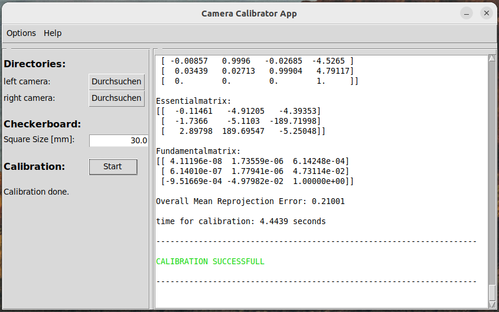

# Camera Calibrator App

Project that helps calibrate a camera using calibration images with standard chessboard patterns and export camera intrinsics and distortion parameters.



## Module layout

The code lives in the [`camera_calibrator`](camera_calibrator) package. Key modules:

- [`camera_calibrator/cal.py`](camera_calibrator/cal.py): Core calibration routines. Detects chessboard corners across image pairs or sets, calculates intrinsic matrix, distortion coefficients, reprojection error, and exports results.
- [`camera_calibrator/camera.py`](camera_calibrator/camera.py): Representation of a calibrated camera and helpers for applying and removing distortion, saving/loading calibration parameters.
- [`camera_calibrator/image.py`](camera_calibrator/image.py): Image loading, preprocessing, and utilities for converting and handling image sets used for calibration.
- [`camera_calibrator/graphics.py`](camera_calibrator/graphics.py): Visualization helpers — drawing detected corners, reprojection points, and overlaying results for inspection.
- [`camera_calibrator/console.py`](camera_calibrator/console.py): Simple CLI/console interface for running calibration workflows, stepping through image sets, and saving results.
- [`camera_calibrator/__init__.py`](camera_calibrator/__init__.py): Package exports and version metadata.

## Example data

Example chessboard image sets are included under the [`example/`](example) directory:

- [`example/example_left_30mm/`](example/example_left_30mm)
- [`example/example_right_30mm/`](example/example_right_30mm)

These are sample image folders for testing the calibration pipeline. With theses images, you are also able to observe, how these images shall look like. Here you can see an example image set:

| Left Camera (Im_L_1.png) | Right Camera (Im_R_1.png) |
|--------|--------|
|  |  |

## Features

- Detect chessboard corners in image sets (single or stereo image pairs).
- Compute camera intrinsics (focal length, principal point) and distortion coefficients.
- Provide reprojection error metrics to assess calibration quality.
- Visualize detected corners and reprojections to validate results.
- Save and load calibration parameters for later use.

## Installation and Usage

1. Create a Python virtual environment (recommended):

```bash
python3 -m venv .venv
source .venv/bin/activate
```

2. Install dependencies:

```bash
pip install -r requirements.txt
```

3. Run the main application:

```bash
python3 main.py
```

## Development notes

- The calibration routines assume chessboard-style calibration images. Adjust detection settings in [`camera_calibrator/cal.py`](camera_calibrator/cal.py) if you use an alternate pattern.
- Visualization helpers in [`camera_calibrator/graphics.py`](camera_calibrator/graphics.py) are lightweight — they draw overlays for inspection but are not a full GUI.

Planned features are:
- ...

## Contributing

Feel free to open issues or submit pull requests. Keep changes focused and include tests for algorithmic changes where possible.

If you need help or want new features, open an issue or contact the repository owner.
